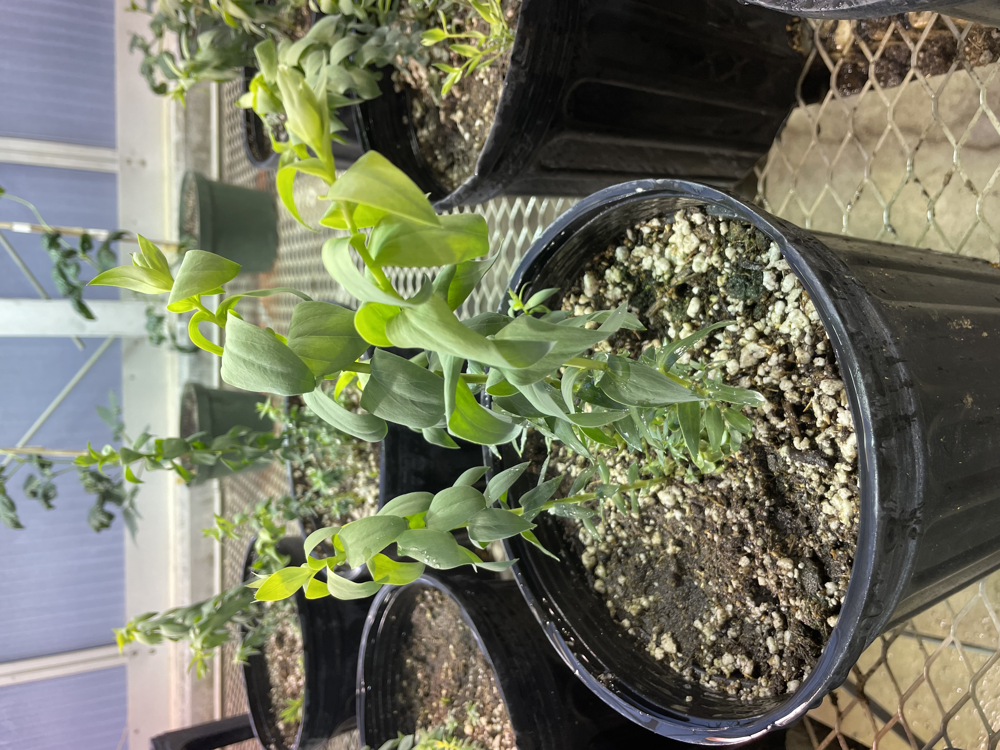
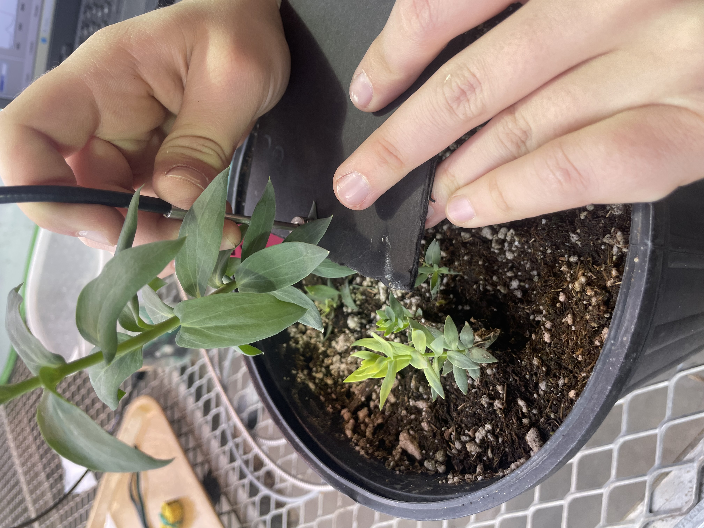
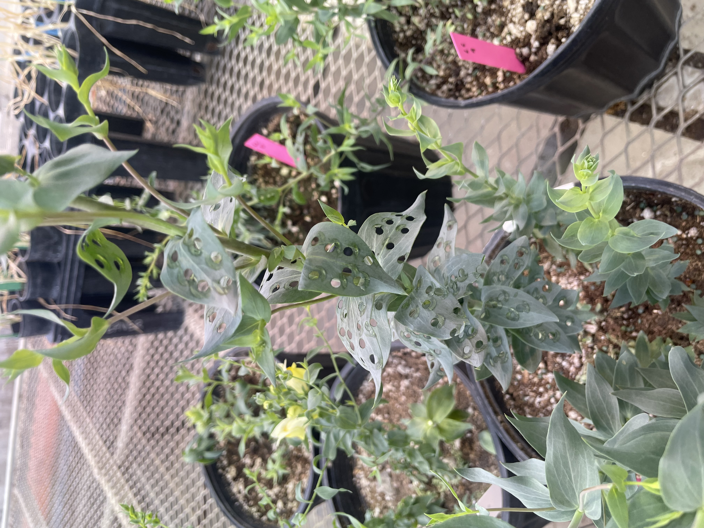

## Housing files related to colab w/ Jackson Strand

Shall be updated as see fit - yippee! 

**Friday, February 13, 2026** (JRS)  
Moved ready plants (from greenhouse) into vernilization. Will remove ~30 plants from vernalization on 2/18/26 so they are ready by 2/23/26. 

**Friday, February 27, 2026** (JRS)  
Plants moved back to greenhouse. Some looking a little rough. I think they'll perk up with adequate water and sunlight.   

**Sunday, March 1, 2026** (JRS)  
Checked greenhouse plants and watered. They are looking better!  

**Monday, March 2, 2026** (JRS)  
First day of data collection. Collected starting at 8:15am.  

- 39 plants
- Damaged 13 with hole punch (50% area) (LC plants) (WHAT SIZE HP?)  
- Damaged 13 by cutting stem 8cm up (TH plants)  
- 13 plants undamaged as controls  (C plants)
- Sorted plants by size and evenly split treatments between them  
- Measured reflectance of lower leaf and upper leaf. Both marked with Sharpie (Ceili forgot puffy paint).

Collected measurements from all plants again starting 1 hour post-damage.   

  

**Tuesday, March 3, 2026** (JRS)  
Second day of collection. Started at 8:15.  

- Collected all leaves again. Added another top leaf (marked with blue puffy paint).  
- Measured height of all stems (found in [3-3-26 data collection file](datacollection_3-3-26.xlsx))

**Monday April 6, 2026**  
We decided that the plants were too variable to continue taking spec measurements. We broke down the plants and measured wet weights of the main stem and the sum of the side stems. Put them in dryer. Will measure dry weights later this week. 

